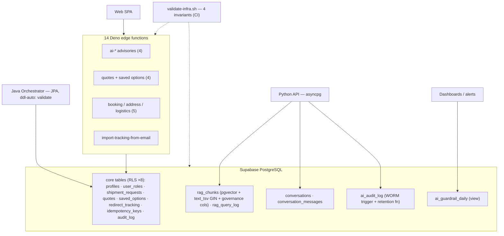
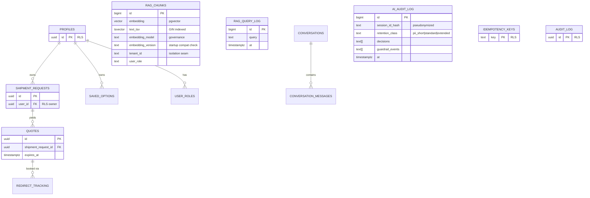
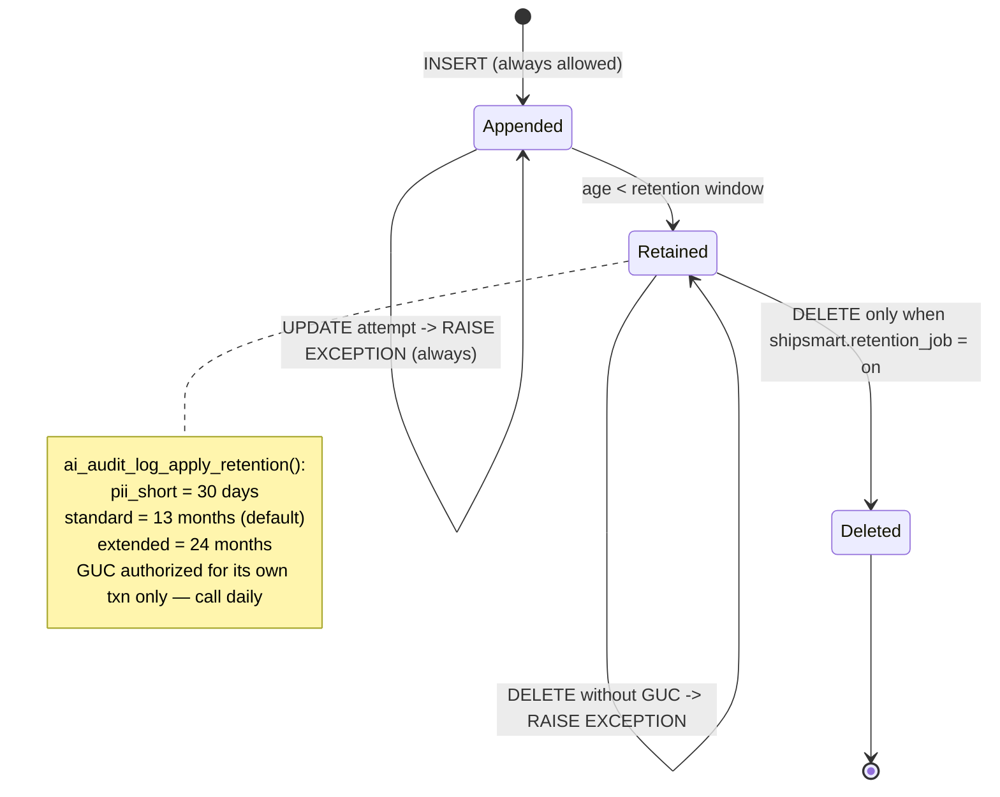
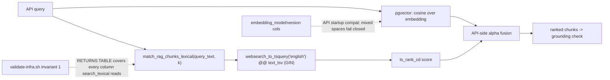
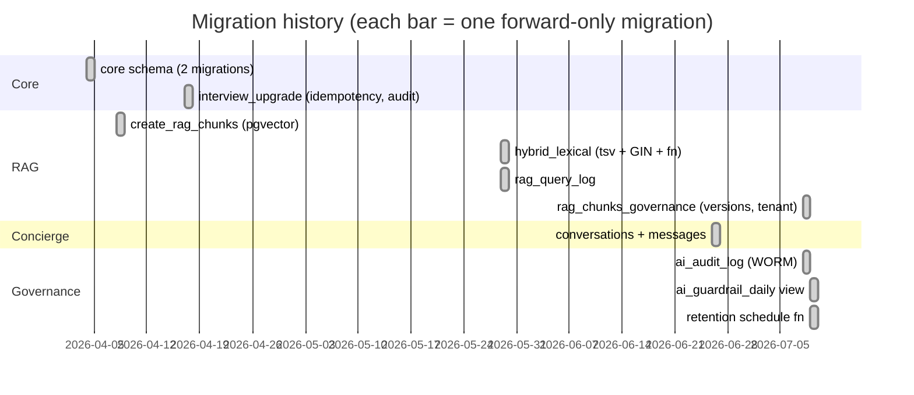
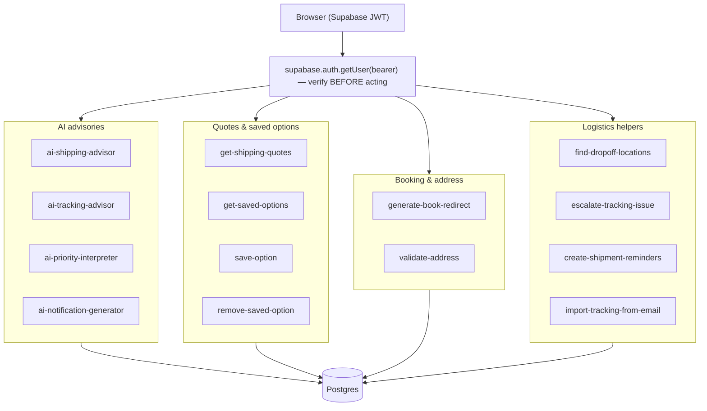
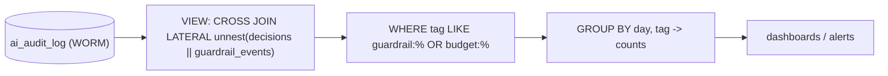
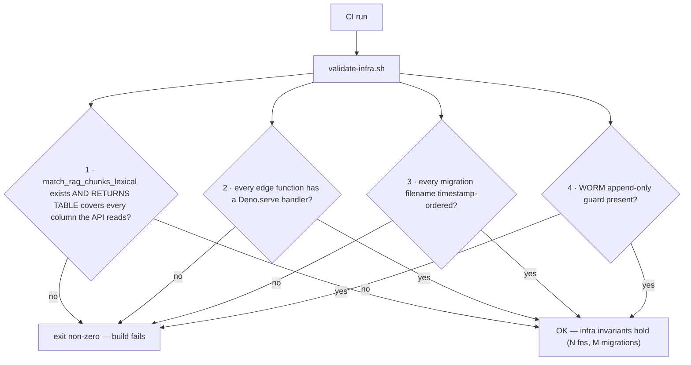

# ShipSmart — Infrastructure (`infra`)

[](https://supabase.com/)
[](https://github.com/pgvector/pgvector)
[](#row-level-security)
[](#the-worm-audit-ledger)
[](https://deno.land/)
[](#the-four-invariant-validator)
[](./LICENSE)

> The **data + serverless substrate** of the ShipSmart platform: 11 forward-only
> migrations, Row-Level Security on every core user-owned table, a **WORM audit
> ledger** whose tamper-evidence is a trigger and whose retention schedule is a
> reviewed SQL function, **hybrid (dense + lexical) vector search** whose column
> contract is CI-asserted against the API — all guarded by a custom
> **four-invariant validator**. The database doesn't just store the platform's
> data; it **enforces the platform's promises.**

This repo has **no Render service of its own** — it ships schema, edge
functions, dev scripts, and the invariants the other services depend on. (For
the live system, see the umbrella's live-mesh links.)

**Stack:** Supabase (Postgres 15 + Auth) · pgvector · tsvector/GIN lexical ·
Deno/TypeScript edge functions · Bash tooling · shellcheck + ruff CI

> **Metric convention:** structural counts and retention classes are facts
> verified against the migrations; performance/durability figures are
> **(target)** / **(illustrative)**.

---

## Table of contents

- [The ShipSmart ecosystem](#the-shipsmart-ecosystem)
- [What this repo owns (HLD)](#what-this-repo-owns-hld)
- [Data model (ER)](#data-model-er)
- [Row-Level Security](#row-level-security)
- [The WORM audit ledger](#the-worm-audit-ledger)
- [Hybrid vector search](#hybrid-vector-search)
- [Migration timeline](#migration-timeline)
- [Edge functions](#edge-functions)
- [Governance read side](#governance-read-side)
- [The four-invariant validator](#the-four-invariant-validator)
- [Threat model](#threat-model)
- [Scripts & local development](#scripts--local-development)
- [License](#license)

---

## The ShipSmart ecosystem

One of six sibling repositories — clone them under the same parent directory so
the dev scripts can find them by relative path. All six are also mirrored
together in **[ShipSmart](https://github.com/nia194/ShipSmart)** — the umbrella
repository that snapshots each component at a pinned commit (see its
`COMPONENTS.yml`).

| Repo | Role | Stack | Render service |
|---|---|---|---|
| [ShipSmart-Web](https://github.com/nia194/ShipSmart-Web) | React SPA — search-first UI | React 19, Vite, TS | `shipsmart-web` |
| [ShipSmart-Orchestrator](https://github.com/nia194/ShipSmart-Orchestrator) | Java system of record — single Postgres writer | Spring Boot 3.4, Java 17 | `shipsmart` |
| [ShipSmart-API](https://github.com/nia194/ShipSmart-API) | Python AI layer — RAG, guardrails, agents | FastAPI, Python 3.13 | `shipsmart-api-python` |
| [ShipSmart-MCP](https://github.com/nia194/ShipSmart-MCP) | Read-only MCP tool server | FastAPI + MCP | `shipsmart-mcp` |
| **[ShipSmart-Infra](https://github.com/nia194/ShipSmart-Infra)** *(this repo)* | Schema + RLS + WORM ledger + pgvector + edge functions | Supabase, Deno, Bash | — |
| [ShipSmart-Test](https://github.com/nia194/ShipSmart-Test) | Cross-repo contracts + evals + e2e | Python 3.13, pytest | — |

---

## What this repo owns (HLD)

**Figure 1 — the substrate and its three consumers.** One schema serves three
runtimes — which is exactly why it is treated as **contract-checked code**, not
"the database."



```
supabase/
  migrations/   11 timestamped, forward-only, idempotent .sql
  functions/    14 Deno/TypeScript edge functions (JWT-verifying)
  config.toml
scripts/        validate-infra.sh · check-env.sh · dev-start.sh ·
                verify-post-deployment.sh
```

---

## Data model (ER)

**Figure 2 — core + AI-plane entities (key fields).** Governance columns live
**on the data**: embedding version (feeds the API's fail-closed startup check),
tenant/role (the multi-tenant seam), retention class (drives the WORM delete
window).



*(Field lists are representative of the key columns — the migrations are the
authoritative source.)*

---

## Row-Level Security

| Table | RLS | Policy |
|---|---|---|
| profiles · user_roles · shipment_requests · quotes · saved_options · redirect_tracking · idempotency_keys · audit_log | ✅ enabled | owner-scoped (user owns their rows) |
| rag_chunks · rag_query_log · conversations · ai_audit_log | service-role access | by design; RLS hardening tracked as a governance follow-up |

Isolation for user-owned data is enforced **inside the database** — even a
compromised app path can't read across users.

---

## The WORM audit ledger

**Figure 3 — `ai_audit_log` lifecycle.** Tamper-evidence is a `BEFORE UPDATE OR
DELETE` **trigger**, not an application promise; even the retention job's
delete permission is scoped to its own transaction.



Identity is pseudonymized (`session_id_hash`); free text is redacted upstream.
"Prove what the AI did" is a query — and the record can neither be silently
edited nor silently evaporate.

---

## Hybrid vector search

**Figure 4 — dense + lexical inside Postgres.** The lexical function's **column
shape is a CI-checked contract** with the API — the classic "DB function
changed, app silently broke" failure is made impossible.



`rag_query_log` captures retrieval telemetry for the eval/online loop.

---

## Migration timeline

**Figure 5 — 11 forward-only migrations (facts).**



Rules: timestamp-named, never edited after apply, idempotent (`IF NOT EXISTS` /
`CREATE OR REPLACE`), additive — the Java `validate` contract keeps passing.

---

## Edge functions

**Figure 6 — the 14 functions by group.** Most verify the Supabase bearer JWT
(`supabase.auth.getUser`) **before** acting.



---

## Governance read side

**Figure 7 — `ai_guardrail_daily`: dashboards never touch the ledger.** The SQL
twin of the API's in-process guardrail metrics — deliberately a plain view (the
log is small; zero refresh machinery).



---

## The four-invariant validator

**Figure 8 — infra-as-contract: `validate-infra.sh` in CI.** On success it
prints the live counts — the validator doubles as the inventory. CI also runs
**shellcheck** and **ruff**.



| # | Invariant | Failure it prevents |
|---|---|---|
| 1 | lexical-fn column contract | silent API↔DB drift |
| 2 | `Deno.serve` per function | dead/unroutable function ships |
| 3 | timestamp naming | migration-ordering bugs |
| 4 | WORM guard present | the governance control itself regressing |

---

## Threat model

| Threat | Control |
|---|---|
| Cross-user reads | RLS on the 8 core tables |
| Audit tampering | WORM trigger (UPDATE never; DELETE gated) |
| Silent retention abuse | transaction-scoped `shipsmart.retention_job` GUC |
| Schema drift | 4-invariant validator + Java `ddl-auto: validate` |
| Mixed embedding spaces | version columns + API fail-closed startup check |
| Unauthenticated edge calls | `supabase.auth.getUser` before acting |

Durability/availability ride on managed Postgres (backups/PITR as platform
features) *(illustrative)*; the retention function is designed for a daily
invocation.

---

## Scripts & local development

```bash
./scripts/check-env.sh                 # env matrix sanity
./scripts/dev-start.sh                 # local supabase workflow
./scripts/validate-infra.sh            # the 4 invariants (run in CI)
./scripts/verify-post-deployment.sh    # post-deploy probes
```

## License

See [LICENSE](./LICENSE).
