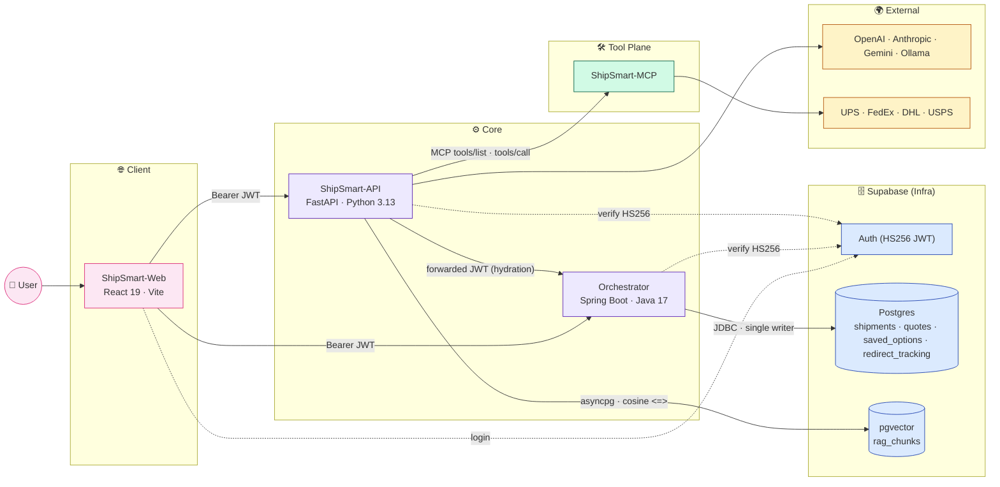
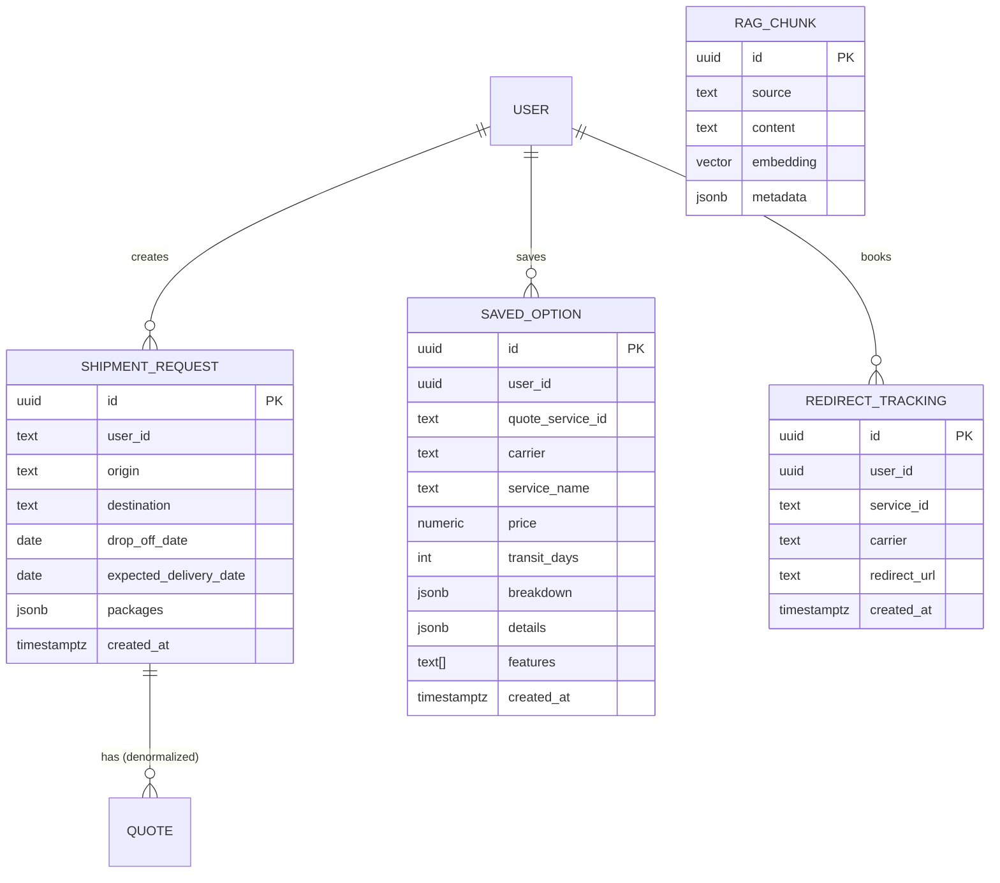
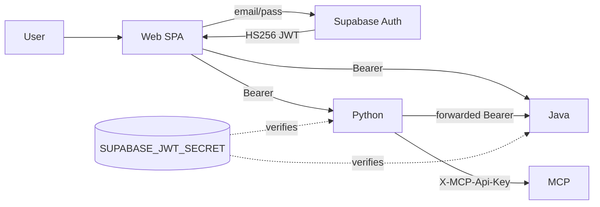

# ShipSmart — Architecture Summary (Current Truth)

> Snapshot of the 5-service system as of 2026-04-18, distilled from code-level exploration of every repo. This document is the starting point for the interview-upgrade plan; it captures what is actually built today, not what we wish were built.

---

## 1. Planes of responsibility

ShipSmart is deliberately split along four logical planes. Each plane has a different failure mode, a different change cadence, and a different correctness guarantee. The repo split follows the planes exactly.

| Plane | Repo | Owns | Failure mode |
|---|---|---|---|
| Client | `ShipSmart-Web` | SPA UI, prompt surface, Supabase JWT holder | Low blast radius: blank page or stale data |
| Transactional | `ShipSmart-Orchestrator` (Java / Spring Boot 3.4.4) | Shipments, quotes, saved options, bookings — **only writer** to Postgres | Hard outage: no quotes or bookings |
| AI orchestration | `ShipSmart-API` (Python / FastAPI) | Advisors, RAG query, LLM routing, tool orchestration. **No** transactional data. | Soft degrade: Echo / placeholder responses |
| Tool | `ShipSmart-MCP` (Python / FastAPI, MCP protocol) | `tools/list`, `tools/call`, carrier providers | Advisors fall back to RAG-only |
| Data / Identity | `ShipSmart-Infra` (Supabase) | Postgres schema, pgvector, Auth (HS256), edge functions, Render blueprints | Schema drift breaks both backends |

---

## 2. End-to-end architecture

**Read the arrows:** only Java writes to Postgres; only Python reads pgvector; Python calls Java (never the other way); MCP is the only service that calls carriers; both backends independently verify the Supabase JWT (no inter-service trust, only service ↔ Supabase trust).

---

## 3. What each repo currently contains

### 3.1 ShipSmart-Orchestrator (Java · Spring Boot 3.4.4)

**Stack:** Spring Boot 3.4.4 · Java 17 · Gradle 8.12 · Spring Data JPA · PostgreSQL · jjwt 0.12.6 · Lombok · dotenv-java 3.1.0.

**Endpoints today:**

| Method + path | Status | Notes |
|---|---|---|
| `GET /api/v1/health` | ✅ Real | Simple `HealthResponse` |
| `GET /api/v1/shipments[/{id}]` | ⛔ **Stub** | Returns hardcoded TODO maps; no service wiring |
| `POST /api/v1/shipments` | ⛔ **Stub** | Accepts `Map<String,Object>`, returns TODO |
| `POST /api/v1/quotes` | ✅ Real | `QuoteService.generateQuotes` — mock + FedEx provider |
| `GET /api/v1/quotes?shipmentRequestId=` | ✅ Real | Regenerates on every call (no cache) |
| `GET /api/v1/saved-options` | ✅ Authenticated | List-only, no pagination |
| `POST /api/v1/saved-options` | ✅ Authenticated | |
| `DELETE /api/v1/saved-options/{id}` | ✅ Authenticated | Hard delete |
| `POST /api/v1/bookings/redirect` | ✅ Real | Redirect URL + audit-stub via RedirectTracking |

**Domain (`src/main/java/com/shipsmart/api/domain/`):** 3 entities — `ShipmentRequest`, `SavedOption`, `RedirectTracking`. None have `@Version`, `updated_at`, `deleted_at`, or a shared `BaseEntity`.

**Services:** 4 files. **No `@Transactional` anywhere.** `ShipmentService.java` is empty (stub). `QuoteService` is 368 lines and calls FedEx sequentially (no fanout). `SavedOptionService` holds a **static** `ObjectMapper` (not a Spring bean).

**Repositories:** `ShipmentRequestRepository`, `SavedOptionRepository`, `RedirectTrackingRepository` — plain `JpaRepository`, two derived queries, no Specifications, no Paging.

**Auth:** `JwtAuthFilter` verifies Supabase HS256 JWT, sets `UsernamePasswordAuthenticationToken`. Generates a short 8-char `requestId` into MDC. **Does not** read inbound `X-Request-Id` or W3C `traceparent`, **does not** emit correlation headers on responses.

**Errors:** `GlobalExceptionHandler` returns a custom `ErrorResponse` record. **Not** `ProblemDetail`. No typed exception hierarchy — handlers are keyed on `IllegalArgumentException` / `MethodArgumentNotValidException` / catch-all `Exception`.

**Startup:** one `EnvLoader @PostConstruct` that reads `.env` into system properties. No `ApplicationRunner`, no boot-time validators.

**Schema management:** Hibernate `ddl-auto: validate` — schema is owned externally by Supabase migrations. **No Flyway** dependency, **no `db/migration/` folder.**

**Tests:** JUnit 5, MockMvc, Mockito, H2 in-memory. **No Testcontainers.** 7 test files covering QuoteService, SavedOption controller + service, Booking service + controller, FedEx provider.

**Gaps (what Phase B will add):** optimistic locking, soft delete, ProblemDetail, pagination + Specifications, Flyway validate, Caffeine cache, Bucket4j rate limit, idempotency keys, AOP audit, correlation + traceparent, OpenAPI, bounded executor + CompletableFuture fanout, Testcontainers ITs.

---

### 3.2 ShipSmart-API (Python · FastAPI 0.135)

**Stack:** FastAPI · Python 3.13 · uv · pgvector · asyncpg · slowapi · OpenAI / Anthropic / Gemini / Ollama / Echo clients.

**Endpoints:** `/rag/{query,ingest}`, `/advisor/{shipping,tracking,recommendation}`, `/orchestration/{run,tools}`, `/health`.

**Already-good Gen-AI properties:** per-task LLM router with terminal `EchoClient`, pluggable embeddings (`OpenAIEmbedding` / `LocalHashEmbedding`), pluggable vector store (`PgVectorStore` / `InMemoryVectorStore`), auto-ingest on first empty-table boot, rule-based → LLM-assisted tool selection with cache, slowapi rate limiting per IP.

**Middleware (`app/core/middleware.py`):** already generates a short 8-char `X-Request-Id` on every response. **Does not** read an incoming `X-Request-Id` or `traceparent` (overwrites instead).

**`java_client.py`:** forwards the caller's JWT on outbound HTTP. Single place to inject correlation headers on outbound (Phase C will use this seam).

---

### 3.3 ShipSmart-MCP

**Stack:** FastAPI · Python 3.13 · MCP-compatible HTTP contract (`/tools/list`, `/tools/call`). Tools: `validate_address`, `get_quote_preview`. Providers: `mock` (default), `ups`, `fedex`, `dhl`, `usps` — real carrier integrations are stubs; only `mock` returns data.

**Middleware:** **CORS only.** No request logging, no correlation id handling. Auth via `X-MCP-Api-Key` dependency.

---

### 3.4 ShipSmart-Web (React 19 SPA)

**Stack:** React 19 · TypeScript 5.9 · Vite · Tailwind + shadcn/ui · TanStack Query · Supabase JS · Zod + react-hook-form.

**Fetch pattern:** **No single centralized wrapper.** Bare `fetch()` at each call site in `src/lib/advisor-api.ts`, `src/hooks/useSavedOptions.ts`, etc. A local `javaFetch` in `useSavedOptions.ts` is the closest thing. `uuid` is not a dep; `crypto.randomUUID()` is available natively.

**Implication:** adding correlation / idempotency / traceparent headers requires either per-callsite edits or introducing a single `src/lib/http.ts` (Phase C1 adds the wrapper; callsites migrate to it).

---

### 3.5 ShipSmart-Infra (Supabase + deployment)

**Contents:** migrations under `supabase/migrations/` following `YYYYMMDDhhmmss_<name>.sql`; existing files:
- `20260404030225_32fa9065-afb4-4fb9-9329-278530382e4c.sql` — base tables (shipment_requests, quotes, saved_options, redirect_tracking, profiles, user_roles).
- `20260404030242_8505bf0b-ff00-4416-bb2a-2430c206ff59.sql` — follow-up RLS / indexes.
- `20260408034204_create_rag_chunks.sql` — pgvector table.

Edge functions, `config.toml`, Render blueprint archives, dev scripts. No `audit_log`, `idempotency_keys`, or `request_log` tables yet.

---

## 4. Cross-service contracts (what traffic exists today)

| Caller | Endpoint / protocol | Used by |
|---|---|---|
| Web → Java | REST + Supabase Bearer JWT | Quote compare, saved options, bookings |
| Web → Python | REST + Supabase Bearer JWT | Advisors, RAG Q&A, recommendations |
| Python → Java | REST, **forwards** the user's JWT | `GET /quotes?shipmentRequestId=…` (recommendation hydration); reserved `/saved-options` read |
| Python → MCP | HTTP + `X-MCP-Api-Key` | `tools/list`, `tools/call` |
| Python → pgvector | asyncpg · cosine `<=>` | RAG embed + retrieve |
| Java → Postgres | JDBC (single writer) | All transactional writes |
| MCP → Carrier APIs | HTTPS (carrier-specific) | Address validate, rate preview |

**Observability gap:** there is no correlation ID that spans Web → Java, Web → Python, or Python → Java / MCP. Each hop has its own local request ID (when it has one at all). Phase B11 + Phase C stitch this together.

---

## 5. Data plane — what's persisted today

**Observations:**
- No `version` / `updated_at` / `deleted_at` on any table — every update is a destructive overwrite.
- Quote data is not a first-class table — it lives inside `SavedOption` JSONB columns and is regenerated on demand by `QuoteService`.
- No audit trail beyond `redirect_tracking` (which is really a per-booking record, not a generic log).
- No idempotency ledger.

Phase B2's migration closes these gaps.

---

## 6. Auth + trust model

- One issuer: Supabase Auth.
- Two verifiers: Java `JwtAuthFilter` and Python JWT dep — both trust the same shared secret.
- **No service-to-service trust** beyond JWT forwarding. MCP uses a separate API key because it is a machine-only boundary.

---

## 7. Where the interview-upgrade will intervene

| Current state | Upgrade target | Plan section |
|---|---|---|
| `ShipmentController` stub | Full CRUD + PATCH + soft-delete + pagination | B3 |
| No optimistic locking | `@Version` on BaseEntity, `If-Match` on PATCH, 409 ProblemDetail | B2 + B3 |
| Custom `ErrorResponse` | RFC 7807 `ProblemDetail` + typed exception hierarchy | B4 |
| `@PostConstruct` only in `EnvLoader` | Real startup validators (`QuoteProviderRegistry`, `FlywayValidationRunner`) | B5 |
| Sequential carrier calls | Bounded `ThreadPoolExecutor` + `CompletableFuture` fanout w/ MDC copy | B6 |
| No caching | Caffeine on `getQuotesByShipmentId` + `getShipmentById` | B7 |
| No rate limiting | Bucket4j per-IP on public POSTs | B8 |
| No idempotency | `@Idempotent` + `IdempotencyInterceptor` + `idempotency_keys` table | B9 |
| No audit | `@Audited` AOP aspect → `audit_log` async | B10 |
| Local-only MDC requestId | `CorrelationIdFilter` + W3C `traceparent` propagation end-to-end | B11 + C |
| No OpenAPI | springdoc UI, `@Schema` on DTOs, `ProblemDetail` documented | B12 |
| H2 unit tests only | Testcontainers Postgres ITs, 60+ new tests | B13 |
| Schema runs in `validate` mode silently | Flyway in validate mode — fails fast on drift (Supabase stays source of truth) | B1 + B2 |

---

## 8. Glossary

- **Hydration** — Python's practice of calling Java with a forwarded user JWT to pull authoritative transactional data (e.g. real quote prices) into an LLM prompt. Prevents hallucinated numbers.
- **Single-writer posture** — all DB mutations go through Java/JPA; no other service writes to Postgres, even when reading shared tables.
- **Plane** — a logical cut of the system with a coherent failure mode and change cadence. Our planes map 1:1 to repos.
- **MCP (Model Context Protocol)** — open HTTP contract (`tools/list`, `tools/call`) for agentic tool execution. Our MCP server is the single source of truth for tool behavior across consumers.
